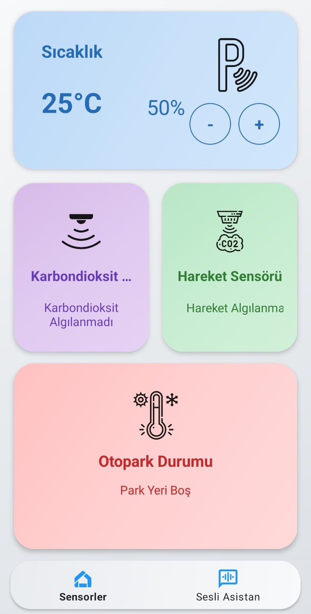
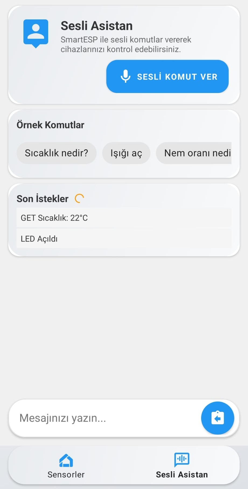

# IoT Sensor Management

This project enables real-time data collection from various sensors (temperature, humidity, motion, gas, piezo) and remote device control using the ESP8266 microcontroller and an Android application.

## Folder Structure

- **android-app/**  
  Contains the Android Studio project. The application is developed in Kotlin and uses OkHttp for data communication.

- **esp8266/**  
  Contains Arduino/C/C++ code running on the ESP8266. This code is responsible for transmitting sensor data to the Android app via HTTP and processing incoming commands.

## Features
- Real-time data collection from various sensors (temperature, humidity, motion, piezo, gas).
- Sending remote control commands (e.g., LED control, temperature adjustment).
- User-friendly interface for monitoring and controlling sensor data within the application.
- Voice assistant integration with text-based command interface
- Support for XML-related error reporting and resolution.

## Architectural Improvements (May 2025 Update)

### 1. Repository Pattern
- Implemented `SensorRepository` that centralizes all data operations
- Used singleton design pattern to ensure consistent data across app lifecycle
- Proper background fetching with lifecycle management

### 2. MVVM Architecture
- Separation of UI (Fragments), business logic (ViewModels), and data (Repository)
- Each screen has its own ViewModel with specific functionality
- Fragment lifecycle awareness for proper resource management

### 3. LiveData Implementation
- All sensor data is now exposed as LiveData for automatic UI updates
- Survives configuration changes and fragment transitions
- Prevents memory leaks during device rotation or app switching

### 4. Navigation Fixes
- HTTP requests continue when navigating between screens
- Improved fragment transaction handling
- Bottom navigation properly configured with navigation components

### 5. UI Improvements
- Responsive layouts with ConstraintLayout
- Properly sized cards and elements with consistent spacing
- Fixed scaling issues for various screen sizes

## Technologies Used
- **Android (Kotlin):** Mobile application development with MVVM architecture.
- **ESP8266 (Arduino):** Microcontroller programming for IoT sensors.
- **HTTP Communication:** RESTful API for data exchange between devices.
- **Material Design:** Modern and responsive UI components.

## Getting Started
1. Flash the ESP8266 with the provided Arduino code
2. Connect to the ESP8266 WiFi network (SSID: SmartHomeSensor)
3. Install and launch the Android app
4. Monitor sensor data on the home screen
5. Use the chat interface to send commands
- **ESP8266:** IoT sensor management and data collection.
- **OkHttp:** Data communication using the HTTP protocol.
- **MVVM:** Structured and maintainable architectural design.
- **Material Design:** Principles for user interface design.

## Setup

### 1. Android Application
- Open the `android-app/` folder in Android Studio.
- Perform the necessary Gradle synchronization.
- Build and run the application on your device or emulator.

### 2. ESP8266 Code
- Open the `.ino` or `.cpp` files located in the `esp8266/` folder using Arduino IDE or PlatformIO.
- Add the required libraries (e.g., WiFi).
- Select your ESP8266 board and upload the code.

## Screenshots

  
  

## Contributing
We welcome feedback via Pull Requests and Issues. Your help is particularly appreciated in the following areas:
- Resolving issues related to the inactivity of the voice assistant.
- Troubleshooting problems with the text assistant.
- Addressing XML-related errors and similar technical issues.

You can also contribute by adding new sensors or improving the code. All suggestions, bug reports, and improvements are highly valued and help enhance the project.

### To-Do / Features to be Added:

- **Voice and Text Assistant Integration:** The voice and text assistants will be activated in future updates, enhancing user interaction with the system.

## License
This project is licensed under the MIT License. For details, see [LICENSE](LICENSE).
